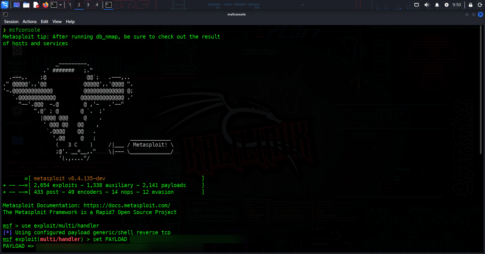
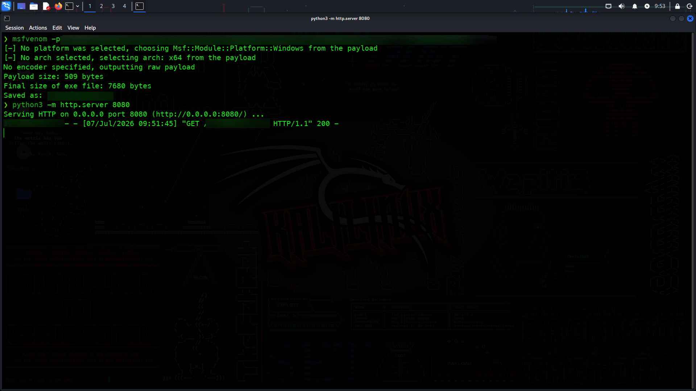
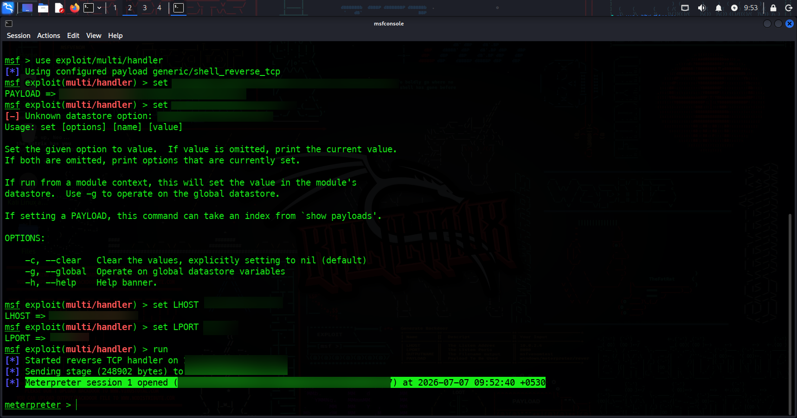
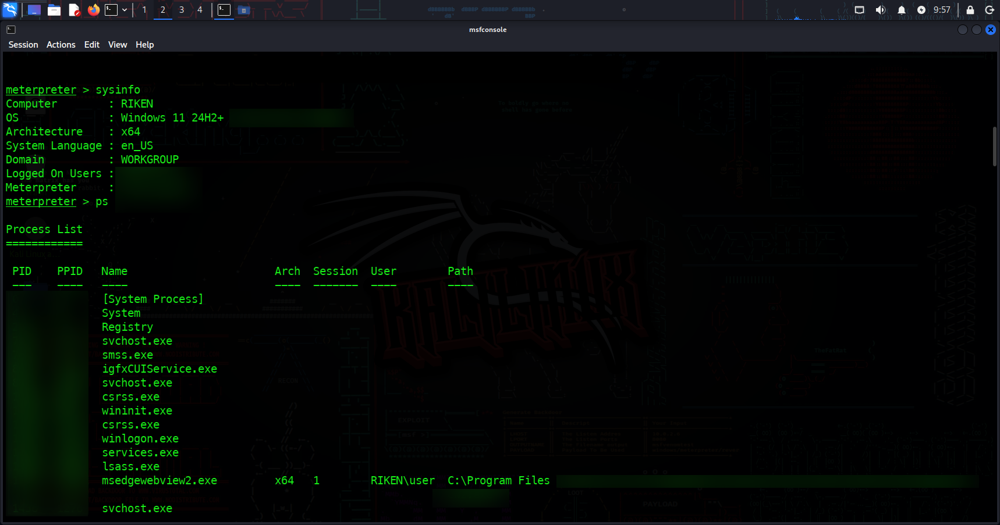
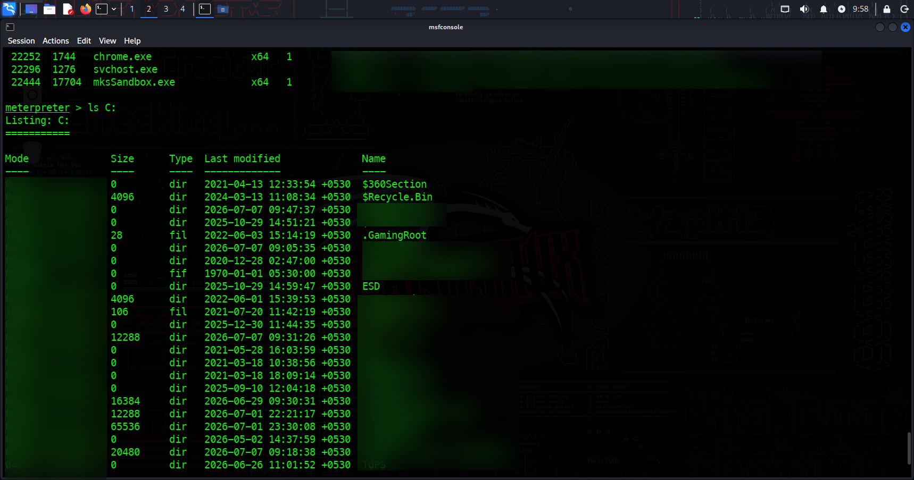
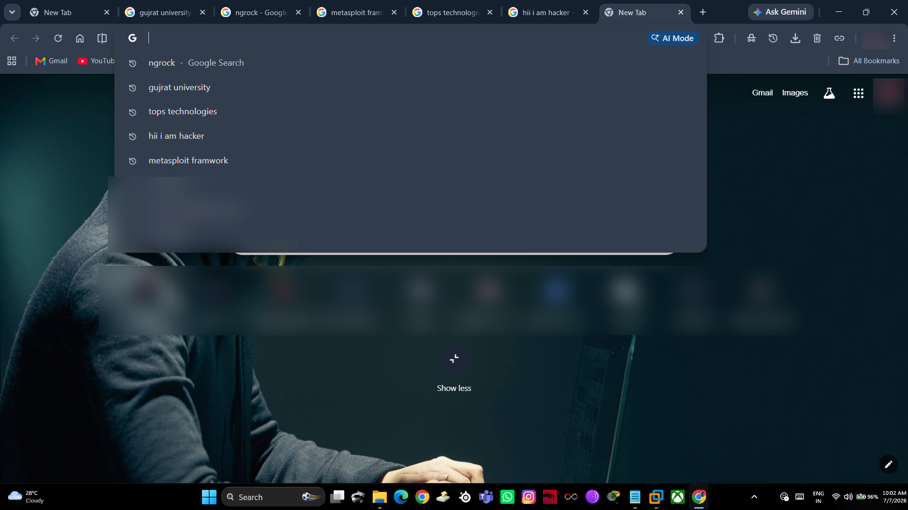
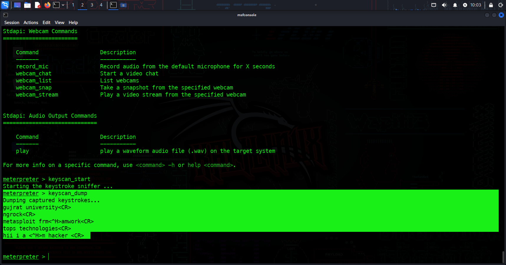

# 🛡️ Windows Security Assessment Lab using Metasploit

## 📌 Overview

This project demonstrates a Windows security assessment conducted in a controlled and authorized virtual lab environment using the Metasploit Framework.

The objective was to understand post-exploitation concepts, Windows system enumeration, remote administration techniques, and endpoint security risks from a defender's perspective.

> **Disclaimer**
>
> This project was performed only in my personal lab environment using systems owned and authorized by me.
>
> The purpose of this project is cybersecurity education, security research, and defensive awareness only.

---

# 🎯 Objectives

- Understand post-exploitation techniques
- Practice Windows system enumeration
- Analyze endpoint security risks
- Improve hands-on experience with Metasploit Framework
- Strengthen knowledge of Windows administration from a security perspective

---

# 🧪 Lab Environment

| Component | Details |
|-----------|---------|
| Attacker Machine | Kali Linux |
| Target Machine | Windows 11 |
| Framework | Metasploit Framework |
| Network | VMware Virtual Lab |
| Purpose | Authorized Security Testing |

---

# ⚙️ Technologies Used

- Kali Linux
- Windows 11
- Metasploit Framework
- Meterpreter
- Python HTTP Server
- VMware Workstation

---

# 🚀 Project Workflow

### 1. Configure the Metasploit listener

Prepared the listener inside Metasploit Framework for the authorized lab environment.

---

### 2. Generate the lab payload

Created a payload for educational testing inside the isolated virtual lab.

---

### 3. Deliver the payload

Transferred the payload inside the controlled Windows virtual machine.

---

### 4. Establish Meterpreter Session

Successfully established an authorized Meterpreter session.

---

### 5. Windows Enumeration

Collected:

- Operating System Information
- System Architecture
- Logged-in User
- Domain Information

---

### 6. Process Enumeration

Enumerated running processes to understand Windows process management and endpoint visibility.

---

### 7. File System Enumeration

Performed controlled file system navigation inside the authorized lab environment.

---

# 📷 Screenshots
# 📷 Project Demonstration

## 1️⃣ Lab Setup

Initial lab environment consisting of a Kali Linux attacker machine and a Windows target machine configured inside a controlled VMware virtual lab.

---

## 2️⃣ Payload Generation

Generated a Windows Meterpreter payload in the authorized lab environment for educational security testing.

---

## 3️⃣ Meterpreter Session Established

Successfully established an authorized Meterpreter session between the Kali Linux attacker machine and the Windows target system.

---

## 4️⃣ Windows System Information

Collected Windows operating system information including architecture, logged-in user, and system details for security assessment.

---

## 5️⃣ File System Enumeration

Performed controlled file system enumeration within the authorized lab environment to understand Windows directory structure.

---

## 6️⃣ Browser Activity Demonstration

Demonstrated user activity within the Windows browser in a controlled lab environment for cybersecurity awareness and endpoint security research.

---

## 7️⃣ Input Monitoring Output

Observed user input monitoring results in the authorized lab environment to understand endpoint security risks and defensive monitoring concepts.

---

# 🛠️ Skills Demonstrated

- Linux Administration
- Windows Administration
- Metasploit Framework
- Windows Enumeration
- Process Enumeration
- File System Enumeration
- Remote Administration Concepts
- Endpoint Security Assessment
- Cybersecurity Lab Documentation

---

# 📚 Learning Outcomes

Through this project, I gained practical understanding of:

- Windows endpoint enumeration
- Meterpreter fundamentals
- Windows process analysis
- File system navigation
- Secure lab methodology
- Security testing documentation
- Defensive understanding of post-exploitation activities

---

# 👨‍💻 Author

**Riken Patel**

Cybersecurity Enthusiast | RHCSA Certified | SOC Analyst (L1) Aspirant | Ethical Hacker

GitHub:
https://github.com/riken-cybersec

LinkedIn:
https://www.linkedin.com/in/riken-patel-b6196931b
